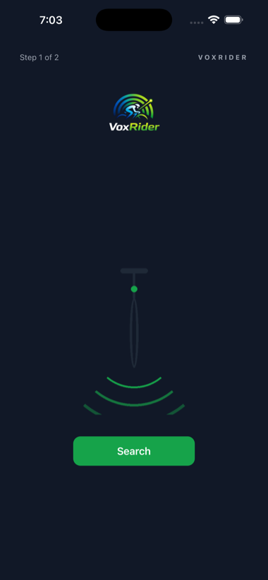
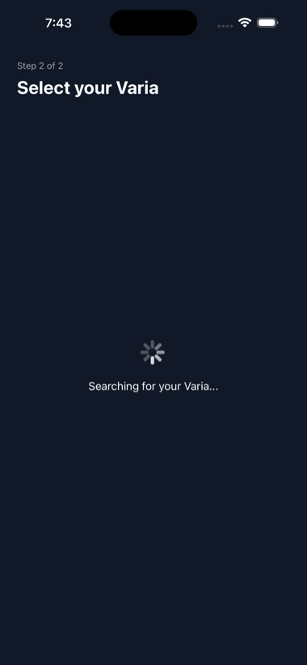
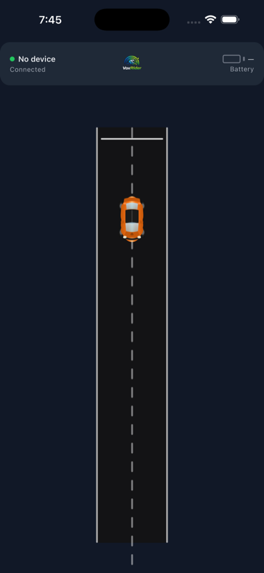
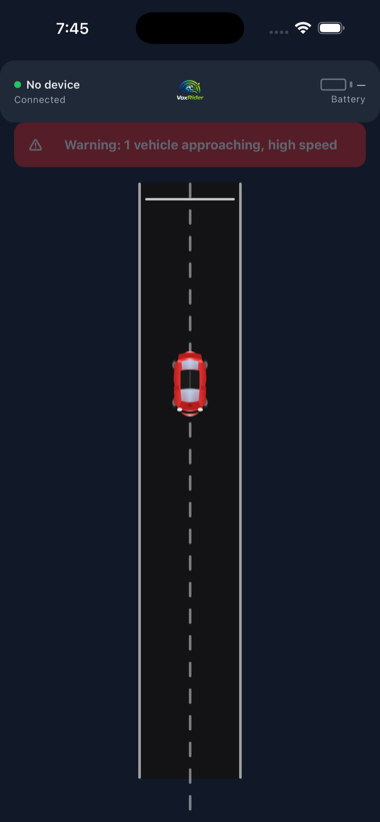
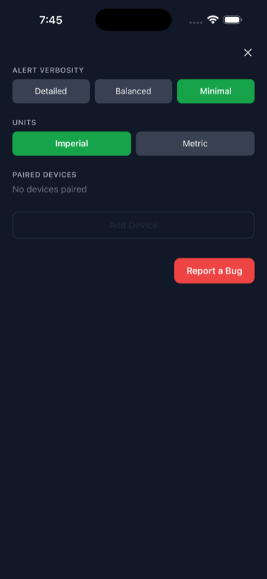

<div align="center">

# VoxRider

**Hear the traffic behind you.**

VoxRider connects to your **Garmin Varia RTL515** bike radar over Bluetooth and speaks traffic alerts straight into your earbuds — *"2 vehicles, high speed"*, *"Clear"* — so you keep your eyes on the road and your hands on the bars. No glancing at a tiny radar light. Hands-free, eyes-free situational awareness for road cyclists.

<a href="https://apps.apple.com/app/voxrider/id6771203798"></a>

🤖 Android — Google Play release in progress (build from source below)

</div>

---

## Screenshots

<table>
  <tr>
    <td align="center" width="20%"></td>
    <td align="center" width="20%"></td>
    <td align="center" width="20%"></td>
    <td align="center" width="20%"></td>
    <td align="center" width="20%"></td>
  </tr>
  <tr>
    <td align="center"><sub><b>Pair in two steps</b><br>Turn on your Varia, tap Search</sub></td>
    <td align="center"><sub><b>Auto-discovery</b><br>Finds your radar over BLE</sub></td>
    <td align="center"><sub><b>Live road view</b><br>Vehicles shown as they close in</sub></td>
    <td align="center"><sub><b>Spoken warnings</b><br>Banner + TTS on every threat</sub></td>
    <td align="center"><sub><b>Tune your alerts</b><br>Verbosity, units, devices</sub></td>
  </tr>
</table>

---

## What it does

- **Pairs with your Garmin Varia RTL515** radar in two quick steps — no Garmin account needed.
- **Speaks every threat aloud** through your earbuds or speaker: *"2 vehicles, high speed"*, *"1 vehicle approaching"*, *"Clear"*. Audio ducks your music so the alert always comes through, then resumes.
- **Shows a live road view** — approaching vehicles appear on a virtual lane and turn red as they close in, with the alert text mirrored in an on-screen banner.
- **Stays alert in your pocket** — keeps working with the screen locked or the app in the background (Android foreground service + iOS background BLE).
- **Auto-reconnects** if the radar drops out, and tells you: *"Radar disconnected"* / *"Radar reconnected"*.
- **Your way** — pick alert verbosity (Detailed / Balanced / Minimal) and units (Imperial / Metric).

---

## Prerequisites

- Node.js ≥ 18
- React Native environment set up per [reactnative.dev/docs/set-up-your-environment](https://reactnative.dev/docs/set-up-your-environment)
- iOS: Xcode 15+, iOS 15+ device or simulator
- Android: Android Studio, API 26+ device or emulator

---

## Setup

```sh
# Install dependencies
npm install

# iOS — install CocoaPods
cd ios && pod install && cd ..
```

---

## Running

```sh
# Start Metro bundler
npm start

# iOS (separate terminal)
npm run ios

# Android (separate terminal)
npm run android
```

---

## Tests

```sh
npm test
```

173 unit tests across 14 suites — BLE packet parser, alert engine (trigger/throttle/debounce), TTS engine (snapshot-on-completion, watchdog, escalation), connection engine (disconnect/reconnect/backoff), alert message builder, the in-process end-to-end alert pipeline, and every UI screen, hook, and permission banner.

End-to-end UI tests use **Detox** and live in `e2e/` — they need the Detox runner, so run them separately:

```sh
npm run e2e:test:ios       # configuration ios.sim.release
npm run e2e:test:android   # configuration android.emu.debug
```

---

## Architecture

See [`ARCHITECTURE.md`](ARCHITECTURE.md) for full data flow, BLE protocol details, component structure, and alert engine rules.

Key files:

| Path | What it does |
|------|-------------|
| `src/ble/RealBLEManager.ts` | BLE scan/connect/subscribe via react-native-ble-plx |
| `src/ble/MockBLEManager.ts` | Test double — used in all JS tests and dev builds |
| `src/ble/parseRadarPacket.ts` | Decodes raw Varia BLE packets → `Threat[]` |
| `src/ble/radarStore.ts` | Zustand store for high-frequency BLE state |
| `src/alerts/AlertEngine.ts` | Threat state → alert trigger decisions |
| `src/alerts/TTSEngine.ts` | Snapshot-on-completion, escalation interrupt, watchdog |
| `src/alerts/NativeTTSBackend.ts` | react-native-tts wrapper (audio ducking, rate) |
| `src/alerts/ConnectionAlertEngine.ts` | Disconnect/reconnect TTS + exponential backoff |
| `src/alerts/NoOpTTSBackend.ts` | Dev placeholder — logs to console, no native TTS |
| `src/settings/settingsStore.ts` | Zustand + AsyncStorage for persisted settings |
| `src/permissions/useBluetoothPermission.ts` | BLE permission request by Android API level |
| `src/ui/screens/MainScreen.tsx` | Radar strip + threat state + battery bar |
| `src/ui/screens/SettingsPanel.tsx` | Verbosity / units / paired devices |
| `src/ui/screens/PairingStep1.tsx` | Turn on Varia — step 1 of pairing |
| `src/ui/screens/PairingStep2.tsx` | Scan + connect — step 2 of pairing |
| `android/app/src/main/java/com/nav1885/voxrider/RadarService.kt` | Android foreground service |

---

## Mock BLE for development

`App.tsx` wires up the real stack (`RealBLEManager` + `NativeTTSBackend`) used in shipping builds. For development or testing without a physical radar, swap in the test doubles:

- `MockBLEManager` (`src/ble/MockBLEManager.ts`) — replays canned threat sequences; used in all JS tests.
- `NoOpTTSBackend` (`src/alerts/NoOpTTSBackend.ts`) — logs utterances to the console instead of speaking.

---

## BLE Protocol

Garmin Varia RTL515 uses a reverse-engineered protocol (community research via pycycling/harbour-tacho):

- **Service UUID:** `6A4E3200-667B-11E3-949A-0800200C9A66`
- **Radar characteristic:** `6A4E3203-667B-11E3-949A-0800200C9A66` (1 Hz, 140 m range)
- **Battery:** Standard BLE Battery Service `0x180F` / `0x2A19`
- **Packet format:** 1-byte header (`rolling_counter:4 | 0x2:4` — the low nibble is *always* `0x2`, **not** a threat count) + 3 bytes/threat: `vehicleId` uint8, `distance` uint8 m, `speed` uint8 km/h (bits 7–6 = threat level). Threat count = `(packet_length − 1) / 3`.

> **Distribution note:** The reverse-engineered radar profile is kept entirely in code/docs — third-party brand names never appear in the user-facing UI (generic "radar" terminology only). VoxRider is live on the iOS App Store under this approach; the Android Play Store release is in progress.

---

## Demo Mode

Hold the Varia power button for 6 seconds to enter demo mode — simulates threat sequences without a real vehicle. Use this for testing the full alert pipeline without riding.

---

## Pinned versions

- React Native: 0.84.1
- Node.js: ≥ 18.0.0
- Android minSdk: 26 (Android 8.0)
- iOS minimum: 15.1
